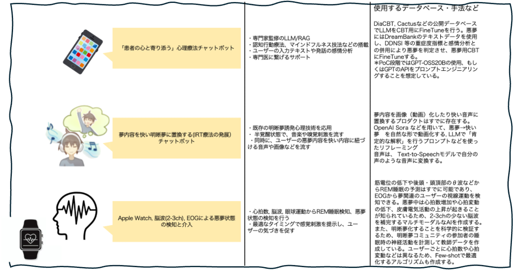

# Bakuのデモ用リポジトリ

上図の構成での開発を行います。

## モックとして提示する機能
ここでは、ソフトウェア部分のMockを提示します。ハードウェアについては、提出資料に記載します。

pip install -r requirements.txt

・脳波データの検知モックコード (rem_analysis.py)
    use example: python rem_analysis.py --subject 0 --recording 1 --output-dir results
    出力はanalysis_outputsに存在します
    脳波データ, EOGデータをもとに可視化します。
    補足： Physionetは睡眠中の脳波データを公開しており、これ以外にも様々な睡眠中脳波データが存在します。私たちは現在REM睡眠判定アルゴリズムを改良しています。

・心拍データから心拍数, 心拍変動を検出するモックコード
    use example: python hr_analysis.py --subject 1 --output-dir analysis_outputs
    出力はanalysis_outputsに存在します
    睡眠中の心拍データから心拍数やRR intervalを検知します。
・眼球運動の検知モックコード ：　https://github.com/Mitachi-H/dreamdive_emotive
    私たちは予備実験として、emotive社の脳波計・EOGを使用しています。その実際のコードを添付します。
・心理療法chatbotのFinetuneに関するモック( demo_mini_llm_cbt.py)
・心理療法chatbotの実行(demo_llm.py)
    use example: python therapy_chat_mock.py を実行させてください。localhostが自動的に立ち上がります。
    現状はLoRAを行っているところで、コードのみとなっています（意味のある応答が出ていません）
    GPT-4oのAPIを叩く形式にしています。.envにOPENAI_API_KEY=sk-... を設定してください
    DiaCBT, Cactusなどの公開データベースは容易に使用でき、DreamBankのテキストデータをの使用や、DDNSI 等の重症度指標の実装をしています。今後はこれを専門家監修のもと進歩させる予定です。

・夢を動画化するモック
    use example: python dream_video_mock.py　を実行させてください。localhostが自動的に立ち上がります。
    現状はLoRAを行っているところで、コードのみとなっています（意味のある応答が出ていません）
     夢内容と幸せな記憶を入力すると、音声及び動画で夢内容をよく解釈させたものの後に、幸せな記憶を動画化させたものを接続させて流します。GPT-4oのAPIを叩く形式にしています。.envにOPENAI_API_KEY=sk-... を設定してください。

・モックアプリ
    use example: python demo_server.py
    感覚刺激を再現しています。脳波を測定し、REM睡眠をdetectすると音などを流します。
